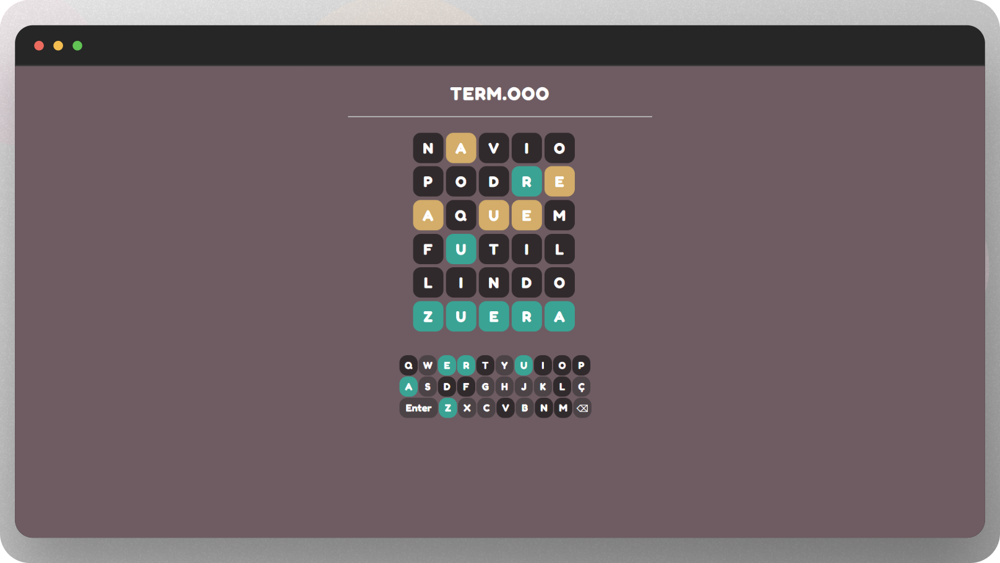

# Wordle | Term.ooo Clone

Bem-vindo ao Wordle | Term.ooo Clone, um jogo simples e divertido de adivinhação de palavras inspirado no popular jogo online Wordle. Este projeto foi desenvolvido utilizando HTML, CSS e JavaScript para criar uma versão leve e acessível do clássico jogo.

## Screenshots



## Início Rápido

Siga estas instruções para obter uma cópia do projeto e executá-lo em sua máquina local para fins de desenvolvimento e teste.

https://vinicius.is-a.dev/wordle

### Pré-requisitos

Não são necessários pré-requisitos específicos. Você apenas precisa de um navegador web moderno.

### Instalação

1. Clone o repositório em sua máquina local.

   ```bash
   git clone https://github.com/vncsmnl/termo.git
   ```

2. Abra o diretório do projeto.

   ```bash
   cd wordle-clone
   ```

3. Abra o arquivo `index.html` em seu navegador web preferido.

## Como Jogar

1. Abra o jogo em seu navegador web, abrindo o arquivo `index.html`.
2. Adivinhe a palavra oculta digitando palavras na caixa de entrada.
3. Cada letra correta será destacada, e letras incorretas serão marcadas.
4. Continue adivinhando até acertar a palavra ou esgotar as tentativas.

## Recursos

- Interface do usuário simples e intuitiva.
- Design responsivo para diferentes tamanhos de tela.
- Tentativas limitadas para adivinhar a palavra, seguindo o formato original do Wordle.

## Desenvolvido Com

- HTML
- CSS
- JavaScript

## Contribuições

Sinta-se à vontade para contribuir para o projeto seguindo estes passos:

1. Faça um fork do projeto.
2. Crie um novo branch com sua nova funcionalidade ou correção de bug: `git checkout -b nome-da-funcionalidade`.
3. Faça suas alterações e as comite: `git commit -m 'Descrição das suas alterações'`.
4. Faça o push para o branch: `git push origin nome-da-funcionalidade`.
5. Abra um pull request.

## Licença

[](https://github.com/vncsmnl/wordle/blob/main/LICENSE)

```
            DO WHAT THE FUCK YOU WANT TO PUBLIC LICENSE
                    Version 2, December 2004

 Copyright (C) 2004 Sam Hocevar <sam@hocevar.net>

 Everyone is permitted to copy and distribute verbatim or modified
 copies of this license document, and changing it is allowed as long
 as the name is changed.

            DO WHAT THE FUCK YOU WANT TO PUBLIC LICENSE
   TERMS AND CONDITIONS FOR COPYING, DISTRIBUTION AND MODIFICATION

  0. You just DO WHAT THE FUCK YOU WANT TO.
```

<a href="#top">🔝 Volte para o topo</a>

<div></div>
<div></div>
